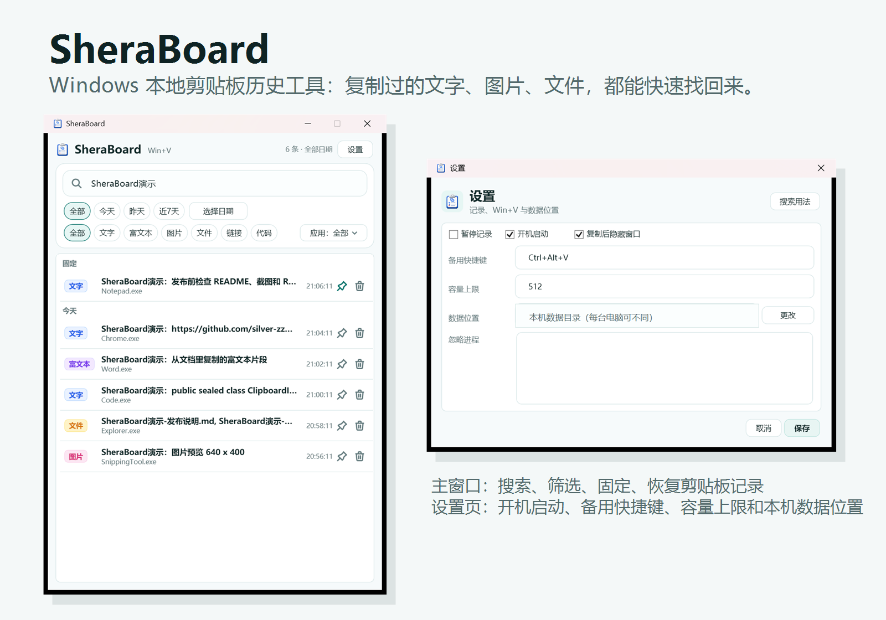
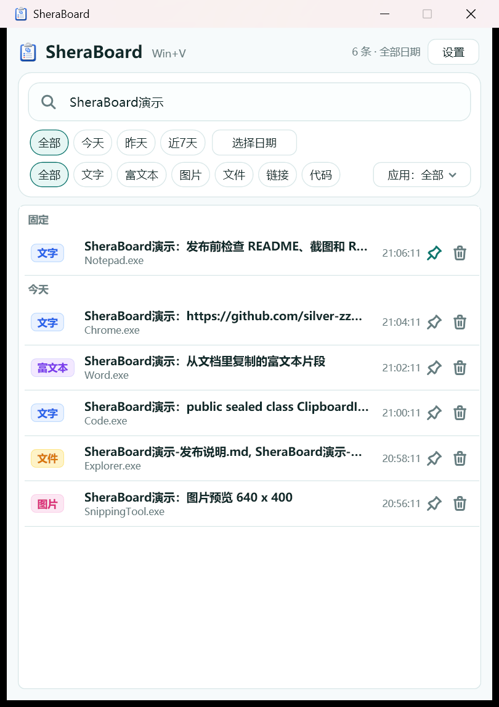
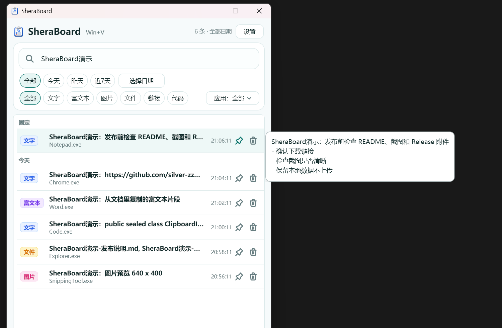
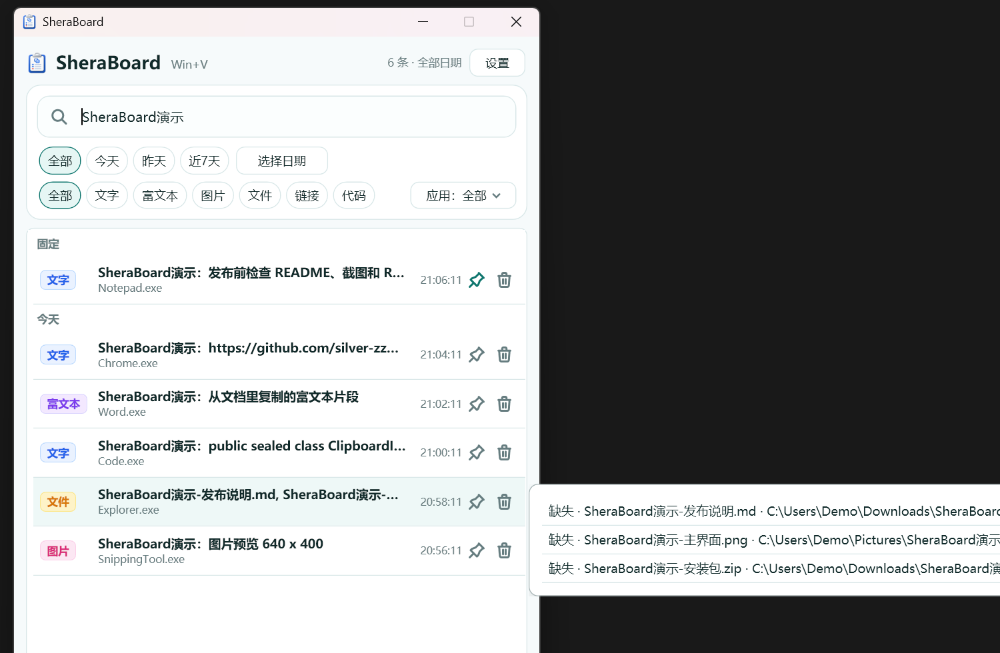
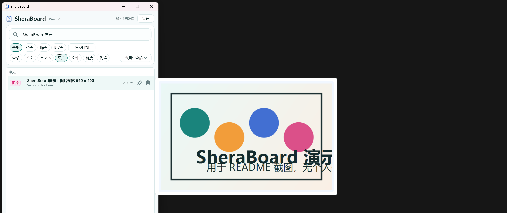
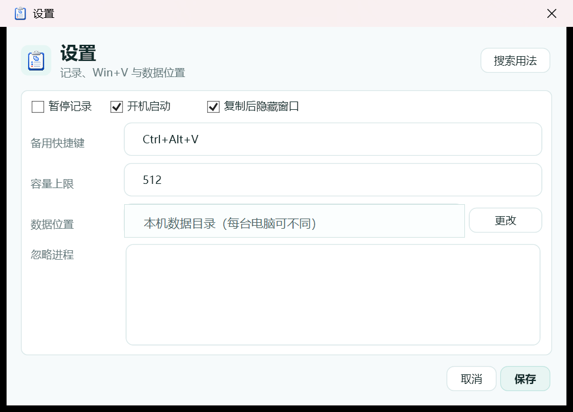

# SheraBoard

SheraBoard 是一款 Windows 本地剪贴板历史工具。复制过的文字、链接、代码、图片和文件，都可以搜索、预览、固定，并一键放回系统剪贴板。



## 下载

正式版本在 [GitHub Releases](https://github.com/silver-zzZ/SheraBoard/releases/latest) 下载。

- 普通用户：不要下载源码压缩包，去 Releases 下载带 exe 的发布包。
- 推荐下载：`SheraBoard-*-win-x64-standalone.zip`，解压后运行 `SheraBoard.exe`。
- 单文件版：`SheraBoard-*-win-x64-standalone.exe`，内置 .NET 运行时，下载后直接运行。
- 小体积版：`SheraBoard-*-win-x64-framework-dependent.zip`，需要先安装 [.NET 8 Windows Desktop Runtime](https://dotnet.microsoft.com/download/dotnet/8.0)。

源码仓库不提交 exe、zip、数据库、剪贴板 payload 或其他本机产物。可执行文件放在 GitHub Releases 里。

## 能做什么

- 自动记录文字、富文本、图片、文件/文件夹复制列表。
- 使用 `Win+V` 打开 SheraBoard 主窗口，快速找回刚才复制过的内容。
- 支持关键词搜索、日期筛选、类型筛选、来源应用筛选。
- 支持链接、代码、图片、文件等常用内容快速过滤。
- 鼠标悬停即可预览完整文字、文件列表和图片内容。
- 支持固定常用记录，双击或右键恢复到系统剪贴板。
- 支持开机启动、复制后隐藏窗口、忽略指定进程、容量上限和本机数据位置设置。
- 剪贴板正文、图片等 payload 使用 Windows DPAPI 按当前用户加密保存。

## 界面预览

### 主窗口

搜索、筛选、固定、删除和恢复都在主窗口完成。



### 悬停预览

鼠标放到记录上，右侧会显示完整内容。不用先恢复到剪贴板，也不用打开额外窗口。







### 设置

开机启动、备用快捷键、容量上限、忽略进程和数据位置都在设置页里。



## 使用

1. 从 [Releases](https://github.com/silver-zzZ/SheraBoard/releases/latest) 下载发布包。
2. 解压发布包。
3. 运行 `SheraBoard.exe`。
4. 使用 `Win+V` 打开 SheraBoard 主窗口，或从托盘图标打开主窗口。
5. 在设置页调整开机启动、保留空间、忽略进程和存储位置。

注意：SheraBoard 运行时会接管 `Win+V`，因此 Windows 原生剪贴板历史面板不会响应这个快捷键。设置页里的备用快捷键默认是 `Ctrl+Alt+V`，可作为额外打开方式。

默认数据目录：

```text
%LOCALAPPDATA%\SheraBoard
```

更完整的使用说明见 [docs/USAGE.md](docs/USAGE.md)，本地数据与隐私说明见 [docs/PRIVACY.md](docs/PRIVACY.md)。
数据路径、自启路径和每台电脑的本地存储规则见 [docs/DATA_STORAGE.md](docs/DATA_STORAGE.md)。

## 开发

开发环境要求：

- Windows 10/11
- Visual Studio 2022
- Visual Studio 安装“.NET 桌面开发”工作负载
- .NET 8 SDK

技术栈：.NET 8 + WPF。

```powershell
dotnet restore SheraBoard.sln
dotnet build SheraBoard.sln
dotnet test SheraBoard.sln
dotnet run --project src/SheraBoard.App/SheraBoard.App.csproj
```

## 贡献

欢迎提交 issue 和 pull request。提交前请至少运行：

```powershell
dotnet test SheraBoard.sln
```

维护者发布流程见 [docs/RELEASING.md](docs/RELEASING.md)。

## 许可证

SheraBoard 使用 MIT License，见 [LICENSE](LICENSE)。
